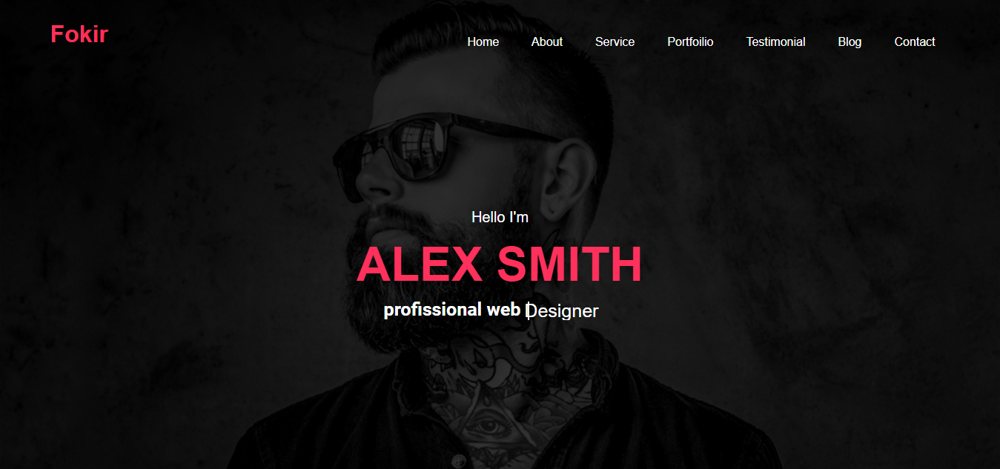
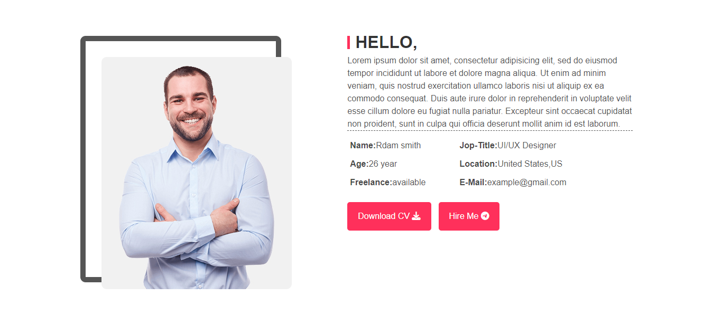

# Fokir CV

Welcome to the **Fokir CV** project! This project is a simple, responsive web-based CV template that showcases professional experiences, skills, and contact information.




## Project Overview

The **Fokir CV** is designed for individuals who want to create an attractive and professional online presence. The CV is built using modern web development techniques to ensure a responsive and user-friendly experience on various devices.

## Features

- **Responsive Design**: Looks great on both desktop and mobile devices.
- **Clean and Modern Layout**: Simple, yet professional design that emphasizes readability.
- **Customizable**: Easily modify sections like experiences, education, skills, and more.
- **Interactive Elements**: Smooth transitions and hover effects using CSS.

## Technologies Used

- **HTML5**: Structuring the content in a semantic way.
- **CSS3**: For styling and layout design.


## Preview

You can preview the live project [here](https://nourkuktut.github.io/FokirCv/).

## How to Use

1. Clone the repository:
   ```bash
   git clone https://github.com/your-username/FokirCv.git
2. Open the index.html file in your favorite web browser to view your CV locally.
3. Modify the content in the index.html file to personalize your CV (e.g., update your name, skills, experience, etc.).

## Future Enhancements:
1. Adding dark mode support.
2. Integrating animations for more interactive sections.

   ## Contact:
For inquiries about this project or similar development services, feel free to contact me:
<br>
**Linkedin: [here](https://www.linkedin.com/in/nourkutkut).**
<br>
**Email:nourkutkut12@gmail.com**

#### Thank you for visiting the Fokir CV project. I hope this template helps you present your skills and experiences effectively!


